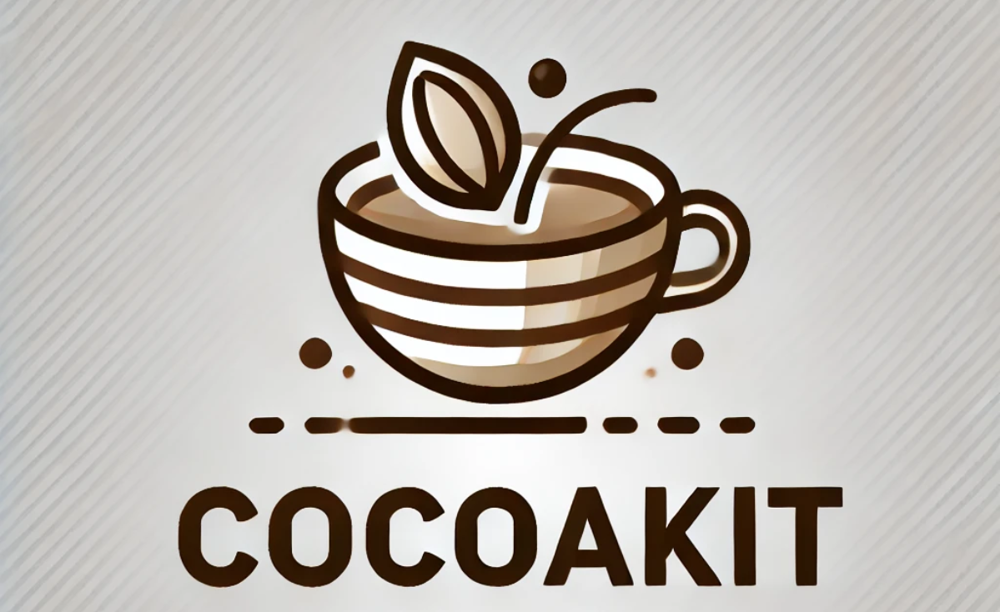

**[简体中文](README.md)** | **English**

# CocoaKit

**CocoaKit** is a lightweight Python desktop automation framework based on the MVC architecture, featuring a basic UI
example and modular code structure for easy customization and extension.



## Project Structure

- Application
    - Common – Miscellaneous utility functions
    - Control – Thread management, logging, database operations, frontend-backend interactions, etc.
    - data – Other project-related data
    - log – Log processing
    - Model – Global data storage
    - Resources – A large number of static resources
    - Tasks – Custom automation tasks
    - tools – Useful functions such as image recognition and input control
    - ui – UI files generated by Qt
    - Units – Contains YOLO model integration
    - View – UI classes
    - public.py – Common variables
- main.py – Entry point of the application
- requirements.txt – Project dependencies file

## Requirements

- Python 3.8 (Make sure to use Python version 3.8 as it ensures compatibility with the framework)
- Windows OS (CocoaKit is designed specifically for Windows desktop environments)

## Install dependencies

```
pip install -r requirements.txt
```

## Features

**CocoaKit** integrates the following key technologies and tools:

1. **PyQt5**: Utilized as the GUI framework to provide a flexible and powerful user interface.
2. **OpenCV, Numpy, PIL**: Implementing the image recognition module for handling various image processing tasks.
3. **pyautogui, win32api, pynput**:
    - Facilitates mouse and keyboard input control.
    - Includes a Bezier curve function for smooth mouse trajectory movement.
4. **win32api**: Supports basic window and process functionalities.
5. **Paddle OCR**: Integrated OCR (Optical Character Recognition) functionality for text recognition in images.
6. **Fastdeploy with ONNX models**:
    - Enables efficient and streamlined object detection using ONNX models.
7. **SQLite**: Provides a lightweight database solution for data storage and management.
